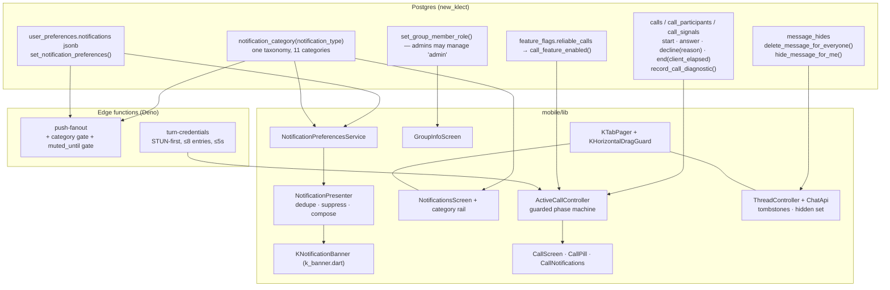
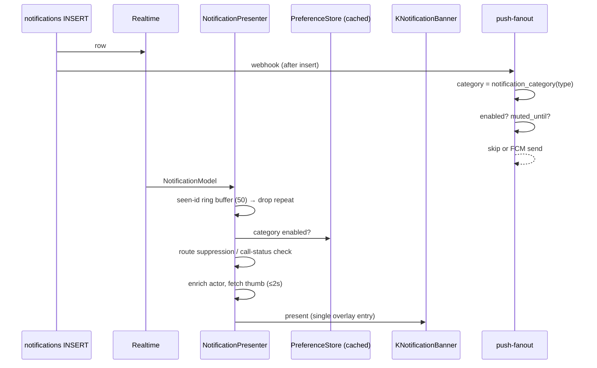
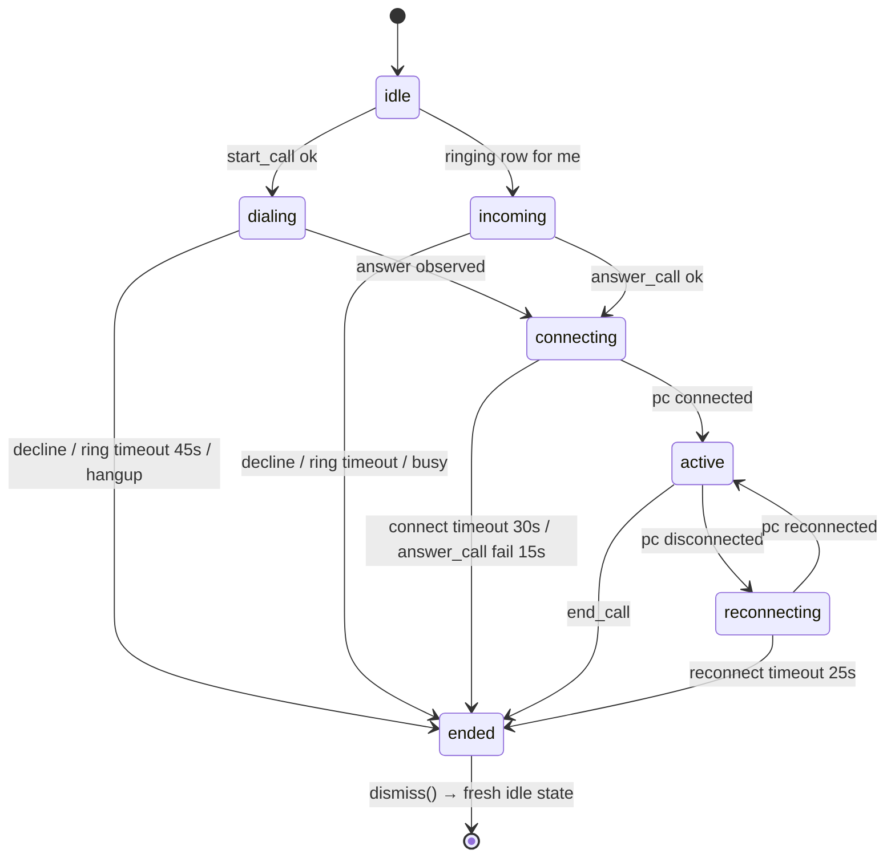
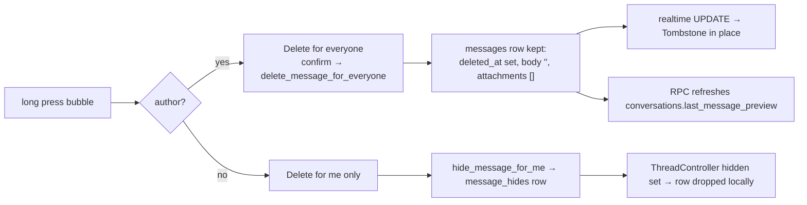

# Design Document

## Overview

This feature closes seven gaps in the KLECT Flutter client (`mobile/`) and the small backend surface
those gaps depend on. Nothing here is greenfield: the WebRTC engine, the call RPC set, the
`turn-credentials` edge function, the group policy contract, `KBanner` and the Alerts list all exist
and are treated as the starting point. The work is a set of **concrete deltas** to named files,
tables and RPCs.

Five workstreams:

| # | Workstream | Mobile surface | Backend delta |
|---|---|---|---|
| A | Notification presentation | `k_banner.dart`, `notification_surfaces.dart` | none |
| B | Category taxonomy, Alert Center filtering, account-synced preferences | `notifications_screen.dart`, `notification_preferences.dart` | `user_preferences.notifications`, `set_notification_preferences`, `notification_category()`, `push-fanout` |
| C | One-to-one calling switched on for real | `calls/`, `call_screen.dart`, new `call_pill.dart`, new `call_notifications.dart` | `decline_call` reason, `end_call` client-elapsed, `record_call_diagnostic`, `turn-credentials` hardening |
| D | Message deletion: tombstone + delete-for-me | `chat_api.dart`, `thread_controller.dart`, `message_bubble.dart`, `message_actions_sheet.dart` | `message_hides`, `delete_message_for_everyone`, `hide_message_for_me` |
| E | Group controls reachability/enforcement + swipeable sibling tabs | `group_info_screen.dart`, `conversation_screen.dart`, new `ui/k_tab_pager.dart` | `set_group_member_role` widened to admins |

### Research findings that shaped the design

Read from the live tree, not assumed:

1. **The call engine is complete but its ICE path fails closed in the wrong direction.**
   `KlectCallIce.resolve()` (`mobile/lib/features/chat/calls/call_config.dart`) **throws**
   `StateError('TURN credentials are unavailable.')` when the edge function returns no relay entry.
   `_openMedia()` awaits it, so the throw propagates into `place()`/`accept()` and the call dies
   before a peer connection exists. Requirements 10.3 and 10.4 demand the opposite: degrade to
   STUN-only with a visible warning. This is the single largest behavioural change in workstream C.
2. **`end_call` already owns duration and is already idempotent.**
   `supabase/migrations/20260727153442_reliable_call_state.sql` computes
   `duration_seconds` from `calls.started_at` and returns the existing row unchanged when the status
   is not `ringing`/`active`. Requirement 7.11 is therefore already satisfied server-side; the client
   must stop treating its own elapsed value as authoritative and pass it as a diagnostic instead.
3. **Deleting a message today really does vanish it.** `ChatApi.deleteMessage` writes
   `deleted_at` + `body = null` directly to the table, and every read path filters
   `deleted_at is null` (`chat_api.dart` `_messageSelect` region, `fetchMessages`, `searchMessages`,
   `klect_api.dart` `fetchMessages`). `ThreadController._onMessageUpdate` calls `_removeMessage`
   when `deleted_at` appears. Tombstones are a read-path change plus a render change, not a new
   column.
4. **Notification preferences are device-local by construction.** `NotificationPreferences` persists
   a muted `Set<NotificationType>` in `KeyValueStore` under `klect.notifications.muted.v1`, and
   `NotificationPresenter.present` is the only consumer. `push-fanout` never sees it, which is why a
   muted category still buzzes the phone.
5. **`user_preferences` exists and is versioned.** Created in
   `20260727152301_messaging_groups_preferences.sql` with an `appearance` JSONB, own-row RLS, and a
   `save_appearance_preferences` RPC as the shape to copy for notifications.
6. **`push-fanout` already honours `conversation_members.muted_until`** with a service-role read, so
   Requirement 5.14 is met today and only needs to survive the new category check.
7. **`NotificationType` has 11 Dart members but no `recommendation`.** `NotificationType.parse`
   falls back to `system` for unknown wire values, and `push-fanout` composes copy for a
   `moderation` type the Dart enum does not carry. A category taxonomy owned by one SQL function and
   mirrored in Dart is the only way the banner, the Alert Center and the fanout can agree.
8. **Call affordances already exist in the thread header.** `_ThreadAppBar` renders audio/video
   `KIconButton`s behind `canCall`, fed by an `autoDispose` `FutureProvider` that re-reads
   `call_feature_enabled` on every thread open. Requirements 6 and 10.6 need a session-scoped
   provider with a 5-minute foreground refresh, plus busy-state disabling — not new buttons.
9. **No Call_Pill and no Tab_Pager exist.** `app.dart` wraps the tree in `IncomingCallOverlay`,
   which is the natural host for the pill. Profile tabs are a `SliverPersistentHeader`
   (`_TabBarDelegate`) with no pager; the only `PageView`s in the app are media pagers
   (`closeup_screen.dart`, `item_screen.dart`) and the create flow (paging disabled). Sibling-tab
   paging is genuinely new UI, and it must not steal drags from those media pagers.
10. **`KBanner` carries literals that the token contract forbids**: a `-96.0` drag clamp and a
    `-200` velocity threshold. Requirement 2 replaces both with token-derived values.
11. **TURN is still unconfigured.** `docs/OPERATIONS.md` lists the TURN server as an open operator
    task, and `turn-credentials` returns `503 turn_not_configured` until
    `CLOUDFLARE_TURN_KEY_ID`/`CLOUDFLARE_TURN_API_TOKEN` exist. The design must make the client
    correct in both states, because enabling `reliable_calls` is an operator action, not a code
    change.

### Non-goals

Web (`web/`) parity, multi-party calling, an SFU, per-chat wallpaper, and root bottom-bar swiping.

---

## Architecture

### System shape



### Where each rule lives

- **Authority stays in Postgres.** Preference validation, delete authorisation, group role rules,
  call state transitions and call duration are all decided by RPCs with `security definer` +
  `set search_path = ''` + `auth.uid()` re-checks, matching the 0012/0017 hardening pattern. The
  client is optimistic and reconciles from the RPC return value.
- **No new counts.** Alert Center per-category unread counts are derived from the `read_at` column
  already carried on each loaded `notifications` row (Requirement 4.7 explicitly forbids a
  client-side aggregate query). No trigger and no counter column is added.
- **One taxonomy, two implementations, one source.** `public.notification_category(type)` is the
  definition; `NotificationCategory` in Dart mirrors it and a single test asserts the two agree for
  every enum label the server reports.
- **Tokens only.** Every value in every touched widget comes from `mobile/lib/design/tokens.g.dart`.
  Values the Token_Set lacks (banner drag limit, fling velocity floor, pager commit fraction,
  overscroll clamp, pill height) are added to `packages/tokens/tokens.json` and regenerated with
  `node packages/tokens/build.mjs` **before** any widget consumes them (Requirement 16.8).

### Notification data flow



Two independent gates by design: the client gate keeps a banner off the screen the instant a switch
flips, and the server gate stops the device buzzing even when the app is dead. Both read the same
category function, so they cannot disagree.

### Call lifecycle



`ended` is absorbing per call id: `_transition()` rejects every outgoing edge, and `dismiss()`
constructs a **new** `ActiveCallState` rather than transitioning out of `ended`.

### Message deletion flow



Read paths stop filtering `deleted_at is null` so the tombstone survives restart and pagination
(Requirement 11.13); search keeps the filter, because a deleted body has nothing to match.

---

## Components and Interfaces

### A. Notification banner — `mobile/lib/ui/k_banner.dart`

`KBanner` is rewritten as `KNotificationBanner` (same `Overlay` strategy, same static entry point so
call sites do not churn) with a typed view model instead of eight loose parameters.

```dart
/// Everything the banner needs, resolved before the overlay is inserted.
class NotificationBannerData {
  const NotificationBannerData({
    required this.notificationId,
    required this.category,
    required this.title,        // one line, ellipsised
    required this.message,      // ≤ 2 lines, ellipsised
    required this.glyph,        // category glyph
    required this.glyphTint,    // action colour, or accent fallback
    this.avatarUrl,
    this.avatarLabel,           // first char fallback when the image fails
    this.thumbUrl,
    this.thumbBlurhash,
    this.actions = const <NotificationBannerAction>[],  // follow-back / accept / decline
    this.onTap,
  });
}

class NotificationBannerAction {
  const NotificationBannerAction({
    required this.label,
    required this.semanticLabel,
    required this.onActivate,        // Future<void>; banner leaves on completion
    this.confirmedLabel,             // "Following" after a follow-back
  });
}
```

Deltas:

- **Layout** (1.2, 1.9): avatar (`Space.s10`) with badged glyph → title/message column → optional
  square thumb (`Space.s10`) → dismiss control, in reading order; card centred, clamped to
  `Layout.readableMaxWidth` (680) and falling back to available width minus `Space.s3` gutters;
  anchored at `MediaQuery.viewPaddingOf(context).top + Space.s2`.
- **Literals removed** (1.1, 16.1): the `-96.0` clamp becomes `Motion.bannerDragLimit`, the `-200`
  velocity becomes `Motion.flingVelocityMin` (400), and the 5 s dwell becomes
  `Motion.bannerDwellMs` — all new `tokens.json` entries.
- **Drag** (2.2–2.4): `1:1` follow up to the drag limit, clamped to `[-limit, 0]`; dwell timer
  suspended during the drag and restarted from full on a returning release; commit on velocity
  ≤ −400 px/s **or** translation ≥ 40 % of the measured card height (height read from a
  `LayoutBuilder`/`RenderBox`, not assumed).
- **Motion** (2.1, 2.6, 2.7): enter `KDurations.medium` (280 ms, inside the 160–480 window), leave
  `KDurations.fast` (140 ms, ≤ 240); `_leaving` already gates input during exit and stays.
  `KMotion.reduced(context)` swaps both for a 90 ms opacity fade with no transform.
- **Counts** (1.7): any count-bearing line renders through `context.kt.count`, which carries
  `tabular: true`.
- **Tap targets** (1.10, 16.3): dismiss and every action use `KPressable` with
  `enforceMinTapTarget: true` (`Layout.tapTargetMin`); the current `enforceMinTapTarget: false` on
  the close glyph is a bug this feature fixes.
- **Single entry** (2.8, 2.9): `show()` returns `false` and drops the newer notification while
  `_current != null` **or** an exit animation is in flight — the current implementation replaces the
  entry instead, which the requirement forbids.

### B. Presenter — `mobile/lib/features/notifications/notification_surfaces.dart`

`NotificationPresenter` keeps its role and gains a pure composition step so the interesting logic is
testable without a widget tree.

```dart
/// Pure: notification + resolved actor/entity + current route + preferences
/// → what the banner should do. No I/O, no BuildContext.
sealed class BannerDecision {
  const factory BannerDecision.present(NotificationBannerData data) = PresentBanner;
  const factory BannerDecision.suppress(BannerSuppression reason) = SuppressBanner;
}

enum BannerSuppression {
  duplicateId,        // 3.10 — 50-entry ring buffer
  categoryDisabled,   // 5.5
  onDestinationRoute, // 3.8
  onAlertCenter,      // 3.9
  callNotRinging,     // 3.11
  bannerMounted,      // 2.8
}

BannerDecision decideBanner({
  required NotificationModel notification,
  required NotificationPreferenceSet preferences,
  required String? currentRoute,
  required CallStatus? callStatus,
  required bool bannerMounted,
  required Set<String> recentlyPresented,   // insertion-ordered, capped at 50
  required BannerContent content,           // actor label, phrase, preview, thumb (nullable)
});
```

- The `_lastPresentedId` single-slot dedupe becomes a 50-entry insertion-ordered ring
  (`_recentIds`), matching 3.10 exactly.
- Per-category composition (3.1–3.6) lives in `notification_copy.dart` as
  `bannerContentFor(NotificationModel)`: message bodies truncated to 140 characters, empty message
  bodies replaced with the attachment kind label, unknown types falling through to the generic shape.
- `call` notifications are checked against `ChatApi.fetchCall(callId).status == ringing` before
  presentation (3.11) and carry accept/decline actions wired to `ActiveCallController` (3.3).
- Destination resolution failure routes to `Routes.notifications` (3.13).
- The 2 s thumbnail/avatar budget (1.3, 1.4, 1.11) is a `Future.any` race against
  `Future.delayed(Motion.thumbTimeout)`; a lost race presents without the thumb and with an initials
  avatar, never an error.

### C. Category taxonomy — new `mobile/lib/features/notifications/notification_category.dart`

```dart
enum NotificationCategory {
  likes('likes'),
  saves('saves'),
  reposts('reposts'),
  commentsAndReplies('comments_and_replies'),
  mentions('mentions'),
  follows('follows'),
  messages('messages'),
  calls('calls'),
  recommendations('recommendations'),
  matches('matches'),
  system('system');

  const NotificationCategory(this.wire);
  final String wire;

  /// Total function: every NotificationType lands in exactly one category,
  /// and unmapped or unknown types land in `system`. Mirrors
  /// public.notification_category(notification_type).
  static NotificationCategory of(NotificationType type);

  ({IconData glyph, Color tint}) style(KlectColors colors);  // action colours, accent fallback
  String get label;                                          // rail chip + empty-state copy
}
```

`notificationStyle()` in `notifications_screen.dart` is refactored to delegate here, so the banner
glyph, the Alert Center row glyph and the rail chip cannot drift (1.6).

### D. Alert Center — `mobile/lib/features/notifications/notifications_screen.dart`

- A `KTabPager`-free horizontal `KChip` rail (`All` + 11 categories in Glossary order) pinned above
  the grouped list; selected chip scrolled into view; each chip `Layout.tapTargetMin` tall.
- Selection lives in a session-scoped provider (`notificationFilterProvider`, a plain `Notifier`
  held by the shell, not `autoDispose`) so reopening restores it and a fresh session starts at `All`
  (4.9).
- Filtering is a **pure list transform** applied to the already-loaded rows:
  `filterNotifications(rows, selection, preferences)` — order preserved, preference-suppressed rows
  removed under every selection, so a single-category list is always a subsequence of `All`
  (4.2–4.5). No refetch, which is what makes the 300 ms budget trivially met.
- Per-category unread counts come from `unreadCountsByCategory(rows)` over the loaded rows'
  `read_at`, rendered `1..99` / `99+` in `context.kt.count` (4.7).
- Realtime arrivals off `notificationEventsProvider` prepend to the backing list; the rendered list
  only changes when the new row matches the selection, while its chip count increments regardless
  (4.11).
- Empty state uses `KEmptyState` with a display-serif headline and one "Show all" action (4.6);
  load failure keeps the previous list and shows `KErrorState` with retry (4.10).
- A `Semantics(liveRegion: true)` announcer publishes "{category}, {n} notifications" once per
  settled selection change (16.9).

### E. Preferences — `mobile/lib/features/notifications/notification_preferences.dart`

Rewritten from a device-local muted set to an account-synced service.

```dart
/// Immutable, total over all 11 categories. Absent key ⇒ enabled.
class NotificationPreferenceSet {
  const NotificationPreferenceSet(this._disabled);
  final Set<NotificationCategory> _disabled;

  static const NotificationPreferenceSet allEnabled = NotificationPreferenceSet({});

  bool isEnabled(NotificationCategory category) => !_disabled.contains(category);
  NotificationPreferenceSet withEnabled(NotificationCategory c, bool enabled);

  /// { "likes": true, "calls": false, ... } — always all 11 keys on write.
  Map<String, bool> toJson();
  static NotificationPreferenceSet fromJson(Object? json);   // tolerant: unknown keys ignored
}

class NotificationPreferencesService extends AsyncNotifier<NotificationPreferenceSet> {
  Future<NotificationPreferenceSet> build();                 // reads user_preferences, migrates legacy
  Future<void> setEnabled(NotificationCategory c, bool enabled);   // optimistic + rollback
}
```

- `build()` selects `user_preferences.notifications` for `auth.uid()`; a missing row or missing key
  is `enabled` (5.8), and the switches are rendered from the resolved set before any switch accepts
  input (5.7).
- `setEnabled` writes through `set_notification_preferences`, applies optimistically, and restores
  the **entire** previous set on error or after 10 s with no message (5.11).
- Legacy migration (5.12, 5.13): if `klect.notifications.muted.v1` exists and
  `klect.notifications.migrated.v1` does not, the muted `NotificationType`s are mapped to their
  categories, written once as `enabled: false`, and the migrated flag is set; from then on the
  device-local key is ignored and never read again. The legacy key is left in place — nothing is
  deleted.
- `SettingsScreen`'s notification section switches from `notificationTypeCopy` (per type) to
  per-category copy; the ordering follows the Glossary.

### F. Push fanout — `supabase/functions/push-fanout/index.ts`

Two inserted gates, both before the FCM token exchange so a suppressed notification costs nothing:

```ts
// 1) category gate (Requirement 5.6, 9.10)
const { data: category } = await supabase
  .rpc("notification_category", { p_type: n.type });
const { data: prefs } = await supabase
  .from("user_preferences").select("notifications")
  .eq("user_id", n.user_id).maybeSingle();
if (prefs?.notifications?.[category] === false) {
  return json({ sent: 0, reason: "category-disabled" });   // 200, no webhook retry
}
// 2) existing muted_until gate stays (Requirement 5.14) — unchanged, and deliberately
//    independent of the messages category flag.
```

`compose()` gains the `recommendation` case and keeps its `default` branch. Call payloads keep
`priority: HIGH` + `channel_id: "calls"` and gain
`android.notification.click_action` plus a `call_id` data field so the client can build the
CallStyle notification with accept/decline actions (9.6).

### G. Call engine — `mobile/lib/features/chat/calls/`

**`call_config.dart`** — `KlectCallIce` stops throwing.

```dart
class IceResolution {
  const IceResolution({
    required this.configuration,   // ready for createPeerConnection
    required this.relayAvailable,  // false ⇒ show the carrier-network warning
    this.failure,                  // 'turn_not_configured' | 'timeout' | 'provider_unavailable'
  });
}

// STUN entries first, relay entries after, list truncated to 8 (Requirement 10.5),
// whole resolution capped at KlectCallTimings.iceConfigTimeout (5 s) (10.1, 10.4).
static Future<IceResolution> resolve();
```

`hasTurn` (a mutable static) is replaced by the per-resolution `relayAvailable` flag carried into
`ActiveCallState`, so two sequential calls cannot inherit each other's relay verdict. A failure or a
STUN-only result is reported once per call id through `record_call_diagnostic` and never retried for
that call (10.4).

**`call_controller.dart`** — the state machine becomes explicit.

```dart
/// The only legal edges (Requirement 7.9). Every state write goes through here.
static const Map<CallPhase, Set<CallPhase>> allowedTransitions = {
  CallPhase.idle:         {CallPhase.dialing, CallPhase.incoming},
  CallPhase.dialing:      {CallPhase.connecting, CallPhase.ended},
  CallPhase.incoming:     {CallPhase.connecting, CallPhase.ended},
  CallPhase.connecting:   {CallPhase.active, CallPhase.ended},
  CallPhase.active:       {CallPhase.reconnecting, CallPhase.ended},
  CallPhase.reconnecting: {CallPhase.active, CallPhase.ended},
  CallPhase.ended:        {},                                  // absorbing (7.10)
};

bool _transition(CallPhase next, {String? endReason});   // false ⇒ rejected, state untouched
```

Deltas beyond the guard:

- **Ring timeout measured from the row** (7.5): `Timer` armed at
  `call.createdAt + KlectCallTimings.ringTimeout - now`, not from the local arm time, and armed for
  `incoming` as well as `dialing` — today only the caller arms it.
- **Connect timeout** (7.15): new 30 s timer armed on entry to `connecting`, ending the call with
  `p_outcome = 'failed'` and zero duration.
- **Answer timeout** (7.14): `answer_call` wrapped in `.timeout(15 s)`; failure → `ended(failed)` +
  released tracks + error surface.
- **Bounded ICE restarts** (7.6): `_restartedIce` (a bool) becomes `_iceRestarts` (an int) capped at
  3, each spaced ≥ `reconnectGrace` (4 s), all inside one 25 s `reconnecting` budget; media tracks
  are explicitly retained across the whole window.
- **Busy decline** (7.16): `IncomingCallController._offer` currently returns silently when a call is
  held. It now calls `decline_call(newCallId, reason: 'busy')` so the caller learns immediately and
  the missed-call notification exists for the recipient.
- **`end_call` arguments** (7.8): `ChatApi.updateCallStatus` passes
  `p_client_elapsed_seconds` (0..86 400, whole seconds, 0 when never `active`); the stored duration
  stays server-computed. Repeat calls are already no-ops server-side, and the controller additionally
  guards with `_closing` + `ended` absorption so at most one `end_call` is issued per call id.
- **Deep-link attach** (7.12): `attach(callId)` returns immediately when the id matches the held
  call in any non-idle phase — already true, and now covered by a test.
- **Back-gesture retention** (7.13): `call_screen.dart`'s `onPopInvoked` currently calls `hangUp()`.
  It instead keeps the call and lets the pill appear; only the explicit end control ends a call.

**Feature gate** — new `callAvailabilityProvider` (`calls/call_availability.dart`):

```dart
class CallAvailability extends Notifier<bool> {
  // Last *successful* read wins; error or >10 s ⇒ false, no user-visible error (10.7).
  // Re-read on foreground when the previous success is ≥ 5 minutes old (10.6).
  Future<void> refreshIfStale();
}
```

`conversation_screen.dart` drops its private `autoDispose` `FutureProvider` and watches this instead,
so one result drives every affordance and every `start_call` attempt (10.6, 10.8).

**Thread header** (Requirement 6): `canCall` becomes
`!isGroup && callsEnabled && !activeCall.isBusy && !_startInFlight`, with disabled-state semantics
exposed rather than the buttons disappearing (6.8). `_startCall` requests permissions first (6.4,
6.9), maps `calls_unavailable`/`not_allowed`/`blocked`/`busy`/`calls_not_allowed`/`participant_busy`
to human copy via `group_errors.dart`'s mapper extended to calls, wraps `start_call` in a 15 s
timeout (6.11), and keeps the composer contents on every failure path (6.5).

**`call_screen.dart`** (Requirement 8): controls gain explicit enabled/on/off semantic labels, a
`Semantics(liveRegion: true)` phase announcer (8.15, 16.4), remote-frame staleness detection at 3 s
(8.5), a draggable local preview clamped inside the safe area (8.4), camera controls hidden for
audio calls and removed from the focus order (8.16), chrome toggling on background tap for active
video (8.14) with restoration on phase change (8.18), and `formatCallDuration(Duration)` /
`parseCallDuration(String)` helpers in a new `calls/call_duration.dart` (`m:ss` / `h:mm:ss`, tabular).
Control failures (8.17) roll back to the last applied state and leave the phase alone.

**New `mobile/lib/features/chat/widgets/call_pill.dart`** (Requirement 9): a `ConsumerWidget`
rendered by `IncomingCallOverlay` (renamed `CallOverlayHost`) when the engine is busy and the current
route is not `/call/:id`; anchored `Layout.bottomBarHeight` above the bottom edge; peer name
truncated to 24 characters, phase label, ticking duration; tap pushes `/call/{id}`; disappears within
1 s of `ended` leaving no reserved space.

**New `mobile/lib/features/chat/calls/call_notifications.dart`** (Requirement 9.6–9.13): wraps
`LocalNotifications` with a CallStyle/full-screen-intent notification carrying exactly two
`AndroidNotificationAction`s (`call_accept`, `call_decline`) keyed by call id; action handling
re-reads the call status first and refuses when it is no longer `ringing` (9.12) or when another call
is live (9.13); cancels on any status change (9.9) and on RPC failure/timeout (9.11).

### H. Messages — tombstone and delete-for-me

**`chat_api.dart`**

```dart
// Reads: `deleted_at is null` filters removed from _messageSelect, fetchMessages and
// fetchMessage so a tombstone survives restart and pagination (11.13).
// searchMessages keeps the filter (an empty body cannot match).

/// Author-only, idempotent. Clears body + attachments, keeps the row, and
/// refreshes conversations.last_message_preview when this was the newest message.
Future<ChatMessage> deleteMessageForEveryone(String messageId);

/// Idempotent per (message, viewer). Returns after the upsert commits.
Future<void> hideMessageForMe(String messageId);

/// The viewer's hidden ids for one conversation, loaded with the first page.
Future<Set<String>> fetchHiddenMessageIds(String conversationId);
```

**`thread_controller.dart`**

- `_onMessageUpdate` stops calling `_removeMessage` when `deleted_at` appears; it replaces the
  message in place, preserving thread order (11.6).
- `delete(messageId)` becomes `deleteForEveryone(messageId)`: optimistic tombstone, rollback to the
  original body/attachments on failure or 10 s timeout, with a retry-carrying error (11.12).
- New `hideForMe(messageId)`: optimistic removal within 500 ms, rollback on failure (12.3, 12.4);
  hidden ids kept in `_hidden` and re-applied to every page and every realtime insert.
- New `_fillVisiblePage()`: after applying hidden state, if a fetched page of ≤ 50 is fully hidden it
  pages older history up to 10 consecutive times per user-initiated load, stopping at the first
  visible message or at exhausted history (12.9); an empty visible thread renders the empty state
  with the composer live (12.10).

**`message_bubble.dart`** — a `_Tombstone` branch when `message.deletedAt != null`: a
non-interactive `KPressable`-free row with a ≤ 40-character label, original timestamp, no reactions,
no attachments, no media open, no swipe-to-reply (11.2, 11.4, 11.7); a deleted reply target renders
as an unavailable label with the jump action disabled and that disabled state exposed (11.5).

**`message_actions_sheet.dart`** — `Delete for me` is present for every message state including
another author's, an already-tombstoned message and a pending/failed send (12.1); both delete
actions gate behind `KConfirmDialog` with scope-naming copy (11.11, 12.2). A tombstone's only action
is delete-for-me (11.4).

**`inbox_controller.dart` / `conversation_tile.dart`** — render the server-refreshed deleted preview
label; ordering timestamp untouched (11.8).

### I. Group controls — `group_info_screen.dart`

The screen exists and already reads `groupPolicy`. Deltas:

- Group header tap already routes here for groups (`_ThreadAppBar.onOpenInfo`); add the loading
  indicator path so the 400 ms budget is met with content-or-spinner (13.1).
- Member count rendered as an integer with the 2..256 bound applied to add-member capacity (13.2,
  13.4).
- Role management widened: promote/demote `admin` offered to admins as well as the owner, never
  targeting the owner (13.5); ownership transfer, join approval, deletion and the three policy
  scopes stay owner-only (13.6).
- Composer lockout (13.9): `conversation_screen.dart` replaces `ChatComposer` with a read-only
  notice naming the governing scope when `groupPolicy.sendMessages.allows(viewerRole)` is false,
  blocking text, attachment and voice-note entry points.
- `GroupPermissionScope.allows` is asserted monotone in role rank (13.10) — it already reads that
  way; the property test pins it.
- Title validation trims then requires 1..60 characters, blocking empty submission with a validation
  message and keeping the stored title (13.3, 13.16).
- Errors map through `group_errors.dart`, extended with `not_owner` and `group_policy_denied`
  (13.11); success refetches conversation + members within 2 s (13.12); failure restores pre-change
  values and keeps the affordance retryable (13.13).

### J. Swipeable sibling tabs — new `mobile/lib/ui/k_tab_pager.dart`

```dart
class KTabPager extends StatefulWidget {
  const KTabPager({
    required this.tabs,          // 2..6 visible members, order preserved
    required this.selectedIndex,
    required this.onSelected,
    required this.builder,       // (context, index) → keep-alive page
    this.routeParam,             // restore-on-open, no animation
  });
}

/// Descendants that own horizontal drags (media pagers, swipe-to-reply,
/// conversation-tile swipe) push a claim; while any claim is held the pager
/// uses NeverScrollableScrollPhysics.
class KHorizontalDragGuard extends InheritedNotifier<HorizontalDragClaims> { ... }
```

- One page per viewport at rest; fewer than two members ⇒ no paging drag (14.1).
- Commit at ≥ 25 % viewport displacement **or** ≥ 400 px/s release velocity, settle within
  `KDurations.deliberate` (480) (14.2, 14.11).
- Indicator position is a pure function of `PageController.page` during a drag, so it tracks
  fractionally and only the settle sets selection (14.3, 14.6).
- Edge behaviour: a custom `ScrollPhysics` clamps overscroll travel to `Motion.pagerOverscrollMax`
  (32) and never wraps (14.12).
- `AutomaticKeepAlive` + `PageStorageKey` per page preserve scroll offset and loaded pages for the
  route lifetime (14.7).
- Hidden members are filtered before paging with order preserved and selection falling back to the
  first remaining member (14.8); an absent/unknown route param opens member 0 silently (14.13).
- Reduced motion: 90 ms opacity page change, indicator jump within 90 ms, drag tracking unchanged
  (14.10).

Adopted by: Pulse modes (`pulse_screen.dart`), profile modes (`profile_screen.dart` —
`_TabBarDelegate` keeps rendering the rail, the pager takes over the body), inbox filters
(`messages_screen.dart`) and the Surf filter rail. Root bottom-bar destinations in
`root_shell.dart` are untouched (locked scope decision).

**Gesture-contract preservation** (Requirement 15): the existing `KGestureRegion` tap/double-tap/
long-press arbitration on surf cards is not modified. The pager sits above the card layer, and
because `closeup_screen.dart`, `item_screen.dart` and `swipe_actions.dart` publish drag claims, a
pointer sequence that begins in any of them is yielded whole (15.2–15.4, 15.8), released within
120 ms of the claim dropping (15.10). Vertical-dominant sequences go to the enclosing scrollable by
the standard Flutter arena, which resolves at the 18 px slop threshold (15.9).

---

## Data Models

### Migration `supabase/migrations/<timestamp>_notifications_calls_messages_overhaul.sql`

One migration, applied to `new_klect`. Everything additive; nothing dropped.

**1. Category taxonomy**

```sql
-- Additive, idempotent: gives the `recommendations` category a real backing label.
alter type public.notification_type add value if not exists 'recommendation';

create or replace function public.notification_category(
  p_type public.notification_type
) returns text
language sql immutable security definer set search_path = ''
as $$
  select case p_type
    when 'like' then 'likes'
    when 'save' then 'saves'
    when 'repost' then 'reposts'
    when 'comment' then 'comments_and_replies'
    when 'reply' then 'comments_and_replies'
    when 'mention' then 'mentions'
    when 'follow' then 'follows'
    when 'message' then 'messages'
    when 'call' then 'calls'
    when 'recommendation' then 'recommendations'
    when 'match' then 'matches'
    else 'system'                       -- total: system absorbs everything else
  end
$$;
```

**2. Preference store**

```sql
alter table public.user_preferences
  add column if not exists notifications jsonb not null default '{}'::jsonb;

-- Whole-payload validation, own-row only, returns the authoritative set.
create or replace function public.set_notification_preferences(p_notifications jsonb)
returns jsonb
language plpgsql security definer set search_path = ''
as $$
declare
  me uuid := public.require_auth();
  v_allowed text[] := array['likes','saves','reposts','comments_and_replies',
                            'mentions','follows','messages','calls',
                            'recommendations','matches','system'];
  k text; v jsonb;
begin
  if jsonb_typeof(p_notifications) <> 'object' then
    raise exception 'bad_notification_preferences';
  end if;
  for k, v in select * from jsonb_each(p_notifications) loop
    if k <> all(v_allowed) or jsonb_typeof(v) <> 'boolean' then
      raise exception 'bad_notification_preferences';   -- rejects the ENTIRE write (5.4)
    end if;
  end loop;

  insert into public.user_preferences (user_id, notifications, updated_at)
  values (me, p_notifications, now())
  on conflict (user_id) do update
    set notifications = excluded.notifications, updated_at = now();

  return (select notifications from public.user_preferences where user_id = me);
end;
$$;
```

Grants: `revoke all ... from anon`, `grant execute ... to authenticated` for both functions.

**3. Delete-for-me + tombstone**

```sql
create table if not exists public.message_hides (
  message_id uuid not null references public.messages(id) on delete cascade,
  user_id uuid not null references public.profiles(id) on delete cascade,
  conversation_id uuid not null references public.conversations(id) on delete cascade,
  created_at timestamptz not null default now(),
  primary key (message_id, user_id)          -- upsert ⇒ idempotent, no duplicates (12.7)
);
create index if not exists message_hides_viewer_conversation_idx
  on public.message_hides (user_id, conversation_id);

alter table public.message_hides enable row level security;
-- own-row only, for select and insert (12.8)
create policy message_hides_select_own on public.message_hides
  for select to authenticated using (user_id = (select auth.uid()));
create policy message_hides_insert_own on public.message_hides
  for insert to authenticated with check (user_id = (select auth.uid()));
revoke all on table public.message_hides from anon;

create or replace function public.hide_message_for_me(p_message uuid)
returns void language plpgsql security definer set search_path = ''
as $$
declare me uuid := public.require_auth(); v_conversation uuid;
begin
  select m.conversation_id into v_conversation
  from public.messages m
  join public.conversation_members cm
    on cm.conversation_id = m.conversation_id and cm.user_id = me
  where m.id = p_message;
  if v_conversation is null then raise exception 'not_member'; end if;

  insert into public.message_hides (message_id, user_id, conversation_id)
  values (p_message, me, v_conversation)
  on conflict (message_id, user_id) do nothing;      -- success on repeat (12.7)
end;
$$;

create or replace function public.delete_message_for_everyone(p_message uuid)
returns jsonb language plpgsql security definer set search_path = ''
as $$
declare me uuid := public.require_auth(); v_message public.messages%rowtype;
begin
  select * into v_message from public.messages where id = p_message for update;
  if not found then raise exception 'message_not_found'; end if;
  if v_message.author_id <> me then raise exception 'not_message_author'; end if;   -- 11.10

  if v_message.deleted_at is null then                 -- idempotent (11.9)
    update public.messages
       set deleted_at = now(), body = '', attachments = '[]'::jsonb, updated_at = now()
     where id = p_message
    returning * into v_message;

    update public.conversations c                      -- 11.8, server-owned preview
       set last_message_preview = 'Message deleted'
     where c.id = v_message.conversation_id
       and c.last_message_id = v_message.id;
  end if;

  return to_jsonb(v_message);
end;
$$;
```

`id`, `author_id`, `reply_to_id` and `created_at` are never written, which is the tombstone
invariant (11.1, 11.3).

**4. Call deltas**

```sql
-- A declining peer can say why (Requirement 7.16 'busy').
create or replace function public.decline_call(p_call uuid, p_reason text default 'declined')
returns jsonb ...   -- end_reason = left(coalesce(nullif(trim(p_reason),''),'declined'), 120)

-- The client's own elapsed value is a diagnostic, never the stored duration.
create or replace function public.end_call(
  p_call uuid,
  p_reason text default 'ended',
  p_outcome public.call_status default 'ended',
  p_client_elapsed_seconds integer default null
) returns jsonb ...
-- diagnostics = diagnostics || jsonb_build_object('client_elapsed_seconds',
--   least(greatest(coalesce(p_client_elapsed_seconds, 0), 0), 86400))

-- Relay verdicts recorded for operator review (10.3, 10.4).
create or replace function public.record_call_diagnostic(
  p_call uuid, p_key text, p_value jsonb
) returns void ...   -- participant-only; merges into calls.diagnostics

-- Admins may manage the admin role; ownership transfer stays owner-only (13.5, 13.6).
create or replace function public.set_group_member_role(
  p_conversation uuid, p_member uuid, p_role public.member_role
) returns void ...
-- p_role = 'owner'  → requires caller role = 'owner'
-- p_role in ('admin','member') → requires is_conversation_admin(p_conversation)
-- target role 'owner' → raise 'not_owner'
```

### Mobile models

| Type | File | Purpose |
|---|---|---|
| `NotificationCategory` | `features/notifications/notification_category.dart` | 11-member taxonomy mirroring the SQL function; glyph + tint + label |
| `NotificationPreferenceSet` | `features/notifications/notification_preferences.dart` | total, immutable, JSON round-trippable |
| `BannerDecision` / `BannerSuppression` | `features/notifications/notification_surfaces.dart` | pure presentation decision |
| `NotificationBannerData` / `NotificationBannerAction` | `ui/k_banner.dart` | banner view model |
| `IceResolution` | `features/chat/calls/call_config.dart` | ordered ICE list + relay verdict + failure reason |
| `ActiveCallState` (+ `relayAvailable`, `chromeVisible`, `remoteFrameStaleSince`) | `features/chat/calls/call_controller.dart` | unchanged shape, three added fields |
| `CallDuration` helpers | `features/chat/calls/call_duration.dart` | `format`/`parse`, `m:ss` and `h:mm:ss` |
| `ChatMessage.isTombstone`, `hiddenForMe` | `core/models/messaging.dart` | derived getters; no new columns |
| `TabPagerModel` | `ui/k_tab_pager.dart` | visible members, selected index, indicator fraction |

### Token additions (`packages/tokens/tokens.json`, then `node packages/tokens/build.mjs`)

| Token | Value | Consumer |
|---|---|---|
| `motion.dwell.banner` | 5000 | banner dwell (2.5) |
| `motion.drag.bannerLimit` | 96 | banner drag clamp (2.2) |
| `motion.drag.commitFraction` | 0.4 | banner dismiss threshold (2.3) |
| `motion.drag.pageCommitFraction` | 0.25 | pager commit (14.2) |
| `motion.drag.flingVelocityMin` | 400 | banner + pager fling floor (2.3, 14.2) |
| `motion.drag.overscrollMax` | 32 | pager edge travel (14.12) |
| `motion.timeout.thumbnail` | 2000 | thumb/avatar budget (1.3, 1.4) |
| `layout.callPillHeight` | 48 | Call_Pill (9.1) |

Call-protocol timings (45 s ring, 30 s connect, 25 s reconnect, 15 s answer/start, 5 s ICE) stay in
`KlectCallTimings` — they are network protocol, not motion, and `DESIGN_SYSTEM.md` caps *animation*
at 480 ms.

---

## Correctness Properties

*A property is a characteristic or behavior that should hold true across all valid executions of a
system — essentially, a formal statement about what the system should do. Properties serve as the
bridge between human-readable specifications and machine-verifiable correctness guarantees.*

These come from the acceptance-criteria prework, after consolidating redundant statements. Criteria
classified as example, edge case, integration or smoke are covered by the Testing Strategy below
rather than by a property.

### Property 1: Banner composition is total and bounded

*For any* notification of any type, including unknown wire values, absent actor names and absent
entity references, the composed banner data carries a non-empty single-line title, a message line of
at most two lines truncated with one trailing ellipsis, a category glyph tinted with that category's
action colour or the accent fallback, a message body truncated to at most 140 characters, and a
thumbnail only where one resolved.

**Validates: Requirements 1.2, 1.6, 1.8, 3.1, 3.4, 3.5, 3.6, 3.12**

### Property 2: Presentation never waits longer than the thumbnail budget

*For any* cover-thumbnail and avatar resolution latency, including failure and never resolving, the
banner presents at the earlier of resolution and 2 seconds, presents without a thumbnail and with an
initials avatar when the budget expires, and surfaces no error indication.

**Validates: Requirements 1.3, 1.4, 1.11**

### Property 3: Banner geometry is derived, never assumed

*For any* available width from 240 to 1400 logical pixels and any status-bar inset, the rendered card
width equals the smaller of 680 logical pixels and the available width minus both gutter insets, the
card is horizontally centred, its top edge sits at or below the status-bar inset, and every
interactive element inside it measures at least 44 by 44 logical pixels.

**Validates: Requirements 1.9, 1.10**

### Property 4: Drag dismissal is a pure decision over displacement and velocity

*For any* sequence of vertical drag deltas and any release velocity, with reduced motion either
enabled or disabled, the banner translation equals the drag sum clamped to the closed interval from
the negative token drag limit to zero, the banner leaves exactly when release velocity is at least
400 logical pixels per second upward or upward translation is at least 40 percent of the measured
card height, and otherwise returns to rest and restarts the dwell period from full.

**Validates: Requirements 2.2, 2.3, 2.4, 2.7**

### Property 5: At most one banner overlay entry exists

*For any* interleaving of present, tap, drag, dwell-expiry and dismiss events, the number of mounted
banner overlay entries is zero or one after every event, a notification arriving while an entry is
mounted or animating is discarded rather than queued, and no discarded notification is ever presented
later.

**Validates: Requirements 2.6, 2.8, 2.9**

### Property 6: Suppression is decided by one predicate

*For any* notification, current route, call row status and preference set, the banner is suppressed
exactly when the notification's category is disabled, the current route is the Alert Center, the
current route equals the notification's destination or is a path-segment child of it, or the
notification is a call whose row status is not `ringing`; and it is presented in every other case.

**Validates: Requirements 3.8, 3.9, 3.11, 5.5**

### Property 7: Presentation is idempotent within a bounded memory

*For any* sequence of notification ids, a notification whose id appears among the 50 most recently
presented ids in the session is presented once and the repeat is discarded, while an id evicted
beyond that window may present again.

**Validates: Requirements 3.10**

### Property 8: Banner actions have exactly one effect each

*For any* follow notification and any ringing call notification, activating an action issues exactly
one corresponding RPC for that target, updates the action label to its confirmed state where one is
defined, removes the banner, and — for a decline — performs no navigation while an accept opens the
call surface.

**Validates: Requirements 3.2, 3.3, 3.7**

### Property 9: Category filtering is an order-preserving, idempotent subsequence

*For any* notification list, any preference set and any category selection, the rendered list is an
order-preserving subsequence of the list rendered under `All`, contains exactly the loaded
notifications of that category that the preference set does not suppress, is unchanged by applying the
same selection a second time, and the `All` list is the newest-first concatenation of the disjoint
category partitions.

**Validates: Requirements 4.2, 4.3, 4.4, 4.5**

### Property 10: Per-category unread counts are derived from row state

*For any* notification list, each category chip's count equals the number of loaded notifications in
that category whose read timestamp is absent, renders as digits for 1 through 99, as `99+` above 99,
and is absent at zero; and a realtime arrival outside the current selection increments its category's
count while leaving the rendered list unchanged.

**Validates: Requirements 4.7, 4.11, 1.7**

### Property 11: Every empty selection yields a bounded, recoverable empty state

*For any* category whose filtered result is empty, the filter rail remains rendered, the empty state
carries a headline of at most 40 characters and a sentence of at most 160 characters, and exactly one
action is offered which returns the selection to `All`.

**Validates: Requirements 4.6**

### Property 12: Filter selection survives the session and resets across sessions

*For any* sequence of category selections, reopening the Alert Center within the same session restores
the last selection, and the first open of a fresh session selects `All`.

**Validates: Requirements 4.9**

### Property 13: A load failure preserves the rendered list and the selection

*For any* previously rendered list, any selection and any load failure, the rendered list and the
selected chip are unchanged and exactly one retry-carrying error indication is surfaced.

**Validates: Requirements 4.10**

### Property 14: Preference sets are total and round-trip

*For any* preference set, encoding then decoding produces an equal set for all 11 categories, the
encoded form carries exactly 11 boolean keys, and decoding any partial, empty, null or unknown-keyed
payload treats every absent category as enabled.

**Validates: Requirements 5.1, 5.8, 5.9**

### Property 15: An invalid preference payload is rejected whole

*For any* payload mixing valid and invalid category keys or non-boolean values, the write is rejected
in its entirety, every one of the 11 category flags is left unchanged, and an invalid-payload error is
returned.

**Validates: Requirements 5.4**

### Property 16: The client gate and the delivery gate agree

*For any* preference set, notification row and conversation mute timestamp, the banner suppression
decision and the push delivery decision agree on the category flag, and delivery is additionally
suppressed whenever the conversation's mute timestamp is later than the current server time,
independently of the `messages` category flag.

**Validates: Requirements 5.6, 5.14, 9.10**

### Property 17: Preference writes are idempotent and roll back completely

*For any* category and boolean value, applying that value twice leaves the store equal to the state
after one application; and for any preference set, attempted change and write failure or 10-second
timeout, the resulting set equals the pre-change set for all 11 categories with no message surfaced.

**Validates: Requirements 5.10, 5.11**

### Property 18: The legacy muted set migrates exactly once

*For any* device-local muted type set, migration writes each muted type's category as disabled,
leaves every other category enabled, commits exactly one preference write per account, and every
subsequent sign-in resolves preferences from the store alone regardless of later changes to the
device-local set.

**Validates: Requirements 5.12, 5.13**

### Property 19: Call affordance visibility and enablement are one predicate

*For any* conversation kind, feature-gate state, held call phase and outstanding-request state, the
voice and video actions are rendered only for a `dm` conversation with a resolved-enabled gate, are
rendered disabled with that state exposed while a call is held or a request is outstanding, and
activating them in any non-enabled or disabled state issues no `start_call` RPC.

**Validates: Requirements 6.1, 6.2, 6.3, 6.8, 6.10, 10.8**

### Property 20: Permissions are requested before, and gate, call creation

*For any* call kind and any combination of already-granted permissions, every permission required by
that kind and not already granted is requested before any `start_call` RPC is issued; and for any
denial, no `start_call` RPC is issued, the composer contents and the current route are unchanged, and
a message naming the denied permission and the blocked call kind is surfaced with one settings action.

**Validates: Requirements 6.4, 6.5, 6.9**

### Property 21: Call creation failure never navigates and always recovers

*For any* `start_call` outcome — success, one of the stable identifiers `calls_unavailable`,
`not_allowed`, `blocked` or `busy`, an unrecognised identifier, or a 15-second timeout — success
pushes exactly one call surface for the returned id, every failure pushes none, surfaces exactly one
mapped or fallback message, and returns both call actions to their enabled state.

**Validates: Requirements 6.6, 6.7, 6.11**

### Property 22: Call phase transitions are legal and `ended` is absorbing

*For any* sequence of call events — RPC results, realtime rows, peer-connection states, timer
expiries and user activations — every observed phase change is a member of the declared transition
set, and once a call id reaches `ended` no further event changes its phase, elapsed duration or
end reason.

**Validates: Requirements 7.9, 7.10, 7.1, 7.2, 7.3**

### Property 23: Every termination path ends once, releases media and reports a clamped duration

*For any* live phase and any termination cause — decline, hang-up, ring timeout measured from the
call row's creation timestamp, 30-second connect timeout, 15-second answer timeout, or 25-second
reconnect timeout — the engine reaches `ended` within 1 second of the cause regardless of RPC
outcome, releases every local audio and video track, and issues at most one `end_call` or
`decline_call` RPC for that call id carrying a whole-second client elapsed value between 0 and 86,400
that is zero when the call never became `active`.

**Validates: Requirements 7.4, 7.5, 7.7, 7.8, 7.11, 7.14, 7.15**

### Property 24: Reconnection is bounded and non-destructive

*For any* disconnect and recovery timeline, the engine retains the local and remote media tracks for
the entire `reconnecting` period, attempts at most 3 ICE restarts spaced at least 4 seconds apart
within one such period, and leaves `reconnecting` only by returning to `active` or by ending after 25
seconds.

**Validates: Requirements 7.6**

### Property 25: A held call is never disturbed by another call or by navigation

*For any* held live phase, an arriving `ringing` row for a different call id is declined with a busy
reason while the held call's phase and media tracks are unchanged; a deep link or notification action
for the held call id issues no further `start_call` or `answer_call`; and leaving the call surface by
the system back gesture issues no `end_call` and makes the call pill visible within 1 second.

**Validates: Requirements 7.12, 7.13, 7.16, 9.13**

### Property 26: In-call controls are involutions and their state is fully reflected

*For any* control among mute, speaker and camera-enable and any starting state, two completed
activations return the engine to its starting state, one completed activation is reflected within 300
milliseconds in the track or output state, the glyph fill, the visible label and the
assistive-technology label together, and camera facing determines local-preview mirroring exactly.

**Validates: Requirements 8.2, 8.3, 8.7, 8.9, 8.13**

### Property 27: Control failures roll back without touching the call

*For any* control activation that fails or does not complete within 1 second, the last successfully
applied control state is retained, exactly one message is surfaced, and the call phase is unchanged.

**Validates: Requirements 8.17**

### Property 28: Call surfaces present exactly the controls the call kind and phase support

*For any* call kind and live phase, the rendered control set equals the set defined for that pair,
each control measures at least 44 by 44 logical pixels, camera controls are absent from both the
widget tree and the assistive-technology focus order for audio calls, and hidden chrome is
simultaneously non-activatable and excluded from the focus order.

**Validates: Requirements 8.1, 8.14, 8.16, 8.18**

### Property 29: Remote video falls back deterministically

*For any* remote-frame arrival timeline, the remote area renders the most recently received frame
while `reconnecting`, and renders the sunken surface with the peer name and an unavailable status
exactly when no frame has arrived for 3 consecutive seconds or no remote video track exists; and for
any drag target and safe-area inset, the local preview rectangle stays inside the safe area by at
least the token inset spacing.

**Validates: Requirements 8.4, 8.5**

### Property 30: Duration formatting round-trips and never goes backwards

*For any* duration from 0 to 86,399 seconds, parsing the formatted string yields the original
duration truncated to whole seconds, the format is `m:ss` below one hour and `h:mm:ss` at or above one
hour; and for any sequence of ticks and phase changes the reported elapsed value is monotonically
non-decreasing while `active`, `reconnecting` or `ended` and constant for the whole time the phase is
`ended`.

**Validates: Requirements 8.10, 8.11, 8.12, 9.2**

### Property 31: The call pill mirrors engine state exactly

*For any* live phase with the call surface off the top of the navigator, the pill is rendered with the
peer name truncated to 24 characters, the phase label and a duration that never decreases across a
tap-driven push of the call surface; minimizing preserves the microphone mute state and keeps remote
audio enabled; and within 1 second of `ended` the pill is absent and reserves no layout space.

**Validates: Requirements 9.3, 9.4, 9.5**

### Property 32: Call notification actions are guarded by server status

*For any* call row status, held phase and RPC outcome, activating an accept or decline action issues
its RPC only when that call is still `ringing` and no other call is live, always cancels the
notification, never overrides the server-reported status locally, and surfaces exactly one message on
refusal, failure or a 10-second timeout.

**Validates: Requirements 9.7, 9.8, 9.9, 9.11, 9.12**

### Property 33: ICE configuration is ordered, capped and degrades instead of failing

*For any* `turn-credentials` response — complete relay entries, entries missing a username or
credential, an empty list, an error, or a response later than 5 seconds — a peer connection is created
at the earlier of resolution and 5 seconds, every STUN entry precedes every relay entry, at most 8
entries are passed by discarding the tail of that order, the carrier-network warning is presented
exactly when no complete relay entry survived, and at most one credential request and one recorded
diagnostic exist per call id.

**Validates: Requirements 10.1, 10.3, 10.4, 10.5**

### Property 34: Call availability is the most recent successful read and fails closed

*For any* sequence of foreground events and RPC outcomes, a re-read is issued only when the previous
successful read is at least 5 minutes old, availability is false after any error or 10-second timeout
with no error surfaced, availability equals the most recent successful result at every instant, and
that value governs every affordance and every `start_call` attempt.

**Validates: Requirements 10.6, 10.7**

### Property 35: Deleting for everyone preserves identity and clears content

*For any* message and any number of repeated deletions, the stored row retains its original message
id, author id, reply-target reference and creation timestamp, carries the deleted marker with an empty
body and no attachment references, occupies the same position in thread order, and is returned in that
shape by every subsequent thread fetch and older-history page.

**Validates: Requirements 11.1, 11.3, 11.7, 11.9, 11.13**

### Property 36: A tombstone renders inert and reveals nothing

*For any* deleted message, any viewer including the author, and any of tap, double tap or long press,
the rendered row carries a label of at most 40 characters, contains no substring of the original body,
renders no attachment thumbnail or placeholder, performs no navigation and opens no media viewer, and
exposes an action set equal to exactly the delete-for-me action; and any message replying to it renders
an unavailable label of at most 40 characters with the jump action disabled and that disabled state
exposed.

**Validates: Requirements 11.2, 11.4, 11.5**

### Property 37: A committed delete propagates in place

*For any* thread and any deleted message position, a realtime delete replaces that bubble with a
tombstone without a manual refresh and without changing any message's position in thread order, and
where the deleted message was the newest, the inbox preview renders the deleted label of at most 40
characters while the conversation's ordering timestamp is unchanged.

**Validates: Requirements 11.6, 11.8**

### Property 38: Destructive message actions are confirmed and reversible on failure

*For any* message, no delete request of either scope is issued before its confirmation is accepted;
and for any delete-for-everyone failure or 10-second timeout, the restored bubble equals the original
body and attachment set exactly, the stored state is unchanged, and one retry-carrying error is
surfaced.

**Validates: Requirements 11.11, 11.12, 12.2, 12.4**

### Property 39: Delete-for-me is isolated, idempotent and takes precedence

*For any* message, any two accounts and any ordering of hide and delete-for-everyone, the hiding
account's rendered thread excludes that message while the other account's thread, unread count and
conversation preview are unchanged, repeated hides leave one stored record and return success each
time, and a hidden message stays hidden for the hiding account instead of rendering a tombstone.

**Validates: Requirements 12.1, 12.3, 12.6, 12.7**

### Property 40: Hidden state survives every subsequent event

*For any* sequence of restarts, sign-out and sign-in on the same account, repeated pagination, edits
and reactions after a hide, the message remains hidden for that account.

**Validates: Requirements 12.5**

### Property 41: Hidden pages are skipped, bounded and terminating

*For any* thread and any pattern of hidden messages, a user-initiated load fetches successive older
pages of at most 50 messages until at least one visible message is rendered, older history is
exhausted, or 10 consecutive pages have been fetched — whichever occurs first — and always terminates.

**Validates: Requirements 12.9**

### Property 42: Group permission scopes are monotone and hidden affordances are absent

*For any* group permission scope and any member role, a scope that permits `member` permits `admin`
and `owner`, and a scope that permits `admin` permits `owner`; and for any role and policy
combination, every affordance the viewer's role does not satisfy is absent from the widget tree rather
than merely invisible, so no hidden affordance is hit-testable.

**Validates: Requirements 13.8, 13.10**

### Property 43: Group role affordances match the widened authority rules

*For any* viewer role and target member role, promotion between `member` and `admin` is offered
exactly to admins and owners, ownership transfer, join-approval toggling, deletion and the three scope
settings are offered exactly to the owner, and no offered role change targets the account whose role
is `owner`.

**Validates: Requirements 13.5, 13.6**

### Property 44: Group identity input is validated on trimmed values

*For any* title string, submission is accepted exactly when the trimmed value is 1 to 60 characters
long, a whitespace-only value of any composition is blocked with a validation message and leaves the
stored title unchanged, and any description of 0 to 500 characters after trimming is accepted.

**Validates: Requirements 13.3, 13.16**

### Property 45: Group state reconciles on success and rolls back on failure

*For any* group change, success refetches the conversation record and member list so every rendered
value equals the refetched value, and any failure, unrecognised error identifier or 10-second timeout
restores the pre-change rendered values exactly, surfaces a not-saved message, and leaves the
affordance enabled for retry.

**Validates: Requirements 13.12, 13.13**

### Property 46: Group error identifiers map totally to human copy

*For any* stable error identifier among `not_admin`, `not_owner`, `not_allowed`,
`group_policy_denied`, `not_group`, `not_member`, `title_required` and `group_needs_members`, a
non-empty distinct human-readable message is produced, and any other identifier produces the generic
fallback message.

**Validates: Requirements 13.11**

### Property 47: The group composer reflects the send scope

*For any* member role and `send_messages` scope, the composer is replaced by a read-only notice naming
the governing scope exactly when the role does not satisfy the scope, and in that state the message
send, attachment and voice-note entry points are all absent from the widget tree.

**Validates: Requirements 13.9**

### Property 48: Group membership rendering is exact

*For any* member list of 2 to 256 members, exactly one role badge drawn from `{owner, admin, member}`
is rendered per member, the displayed member count equals the number of active members as an integer,
add-member capacity equals 256 minus that count, and each system message describing an identity change
appears once at its creation position in thread order.

**Validates: Requirements 13.2, 13.4, 13.15**

### Property 49: Pager selection, page and indicator always agree

*For any* sequence of tab taps and drags, including taps during a running settle animation and drags
at the first and last member, the selected index stays within the closed interval from zero to one less
than the pageable set length, and once every settle and tap animation has completed the selected index,
the rendered page and the indicator position agree.

**Validates: Requirements 14.1, 14.5, 14.6**

### Property 50: Paging commits on a pure threshold decision

*For any* cumulative horizontal displacement and release velocity, with reduced motion either enabled
or disabled, the pager settles on the adjacent member exactly when displacement is at least 25 percent
of the viewport width or release velocity is at least 400 logical pixels per second, otherwise settles
back on the originating member leaving the selection and every member's scroll offset unchanged, and
in both cases settles within 480 milliseconds — 90 milliseconds under reduced motion.

**Validates: Requirements 14.2, 14.4, 14.10, 14.11**

### Property 51: The indicator tracks the drag fraction linearly

*For any* in-progress drag fraction between 0 and 1, the indicator position equals the linear
interpolation between the originating and adjacent tab label positions at that fraction, and the
selected tab state is unchanged until the drag ends.

**Validates: Requirements 14.3**

### Property 52: Edge drags neither move nor wrap

*For any* drag distance beyond the first or last member, the selected index is unchanged, visible
travel beyond that edge is at most 32 logical pixels, the pager returns to rest on release, and the
selection never wraps to the opposite end.

**Validates: Requirements 14.12**

### Property 53: Pager state is preserved across visits

*For any* sequence of member visits and any scroll offsets, each member's scroll offset is restored to
within 1 logical pixel and its already-loaded pages are restored without refetching, for the lifetime
of the enclosing route.

**Validates: Requirements 14.7**

### Property 54: Visibility filtering preserves order and repairs selection

*For any* visibility mask over a sibling tab set, the pageable set is the order-preserving subsequence
of visible members, and where the previously selected member is excluded the selection becomes the
first remaining member.

**Validates: Requirements 14.8**

### Property 55: Tab route parameters round-trip and degrade silently

*For any* member of the pageable set, opening with that member's route parameter selects it with no
page or indicator animation; and for any empty, absent or unknown parameter value, the first member is
selected with no error surfaced.

**Validates: Requirements 14.9, 14.13**

### Property 56: At most one consumer responds to a pointer sequence

*For any* pointer sequence over a thread or feed inside a pager, at most one of swipe-to-reply, a
conversation-tile swipe action and a pager page change responds; a sequence beginning inside a
descendant holding a horizontal-drag claim leaves the selected index unchanged for any drag distance;
a sequence whose vertical displacement exceeds its horizontal displacement when total displacement
first exceeds 18 logical pixels leaves the selected index unchanged; and the pager accepts horizontal
drags again within 120 milliseconds of the last claim being released.

**Validates: Requirements 15.2, 15.3, 15.4, 15.8, 15.9, 15.10**

### Property 57: Card gestures classify identically inside and outside a pager

*For any* card and any of a single tap, a second tap within 300 milliseconds and 18 logical pixels, or
a 500-millisecond press with at most 18 logical pixels of movement, the resulting destination is the
same inside a pager as outside one: the second tap cancels the Closeup transition leaving no Closeup
route on the stack and opens the immersive viewer, the qualifying press opens the radial peek with the
Closeup unstarted, and a press that moves more than 18 logical pixels before 500 milliseconds opens
neither.

**Validates: Requirements 15.1, 15.6, 15.7, 15.11**

### Property 58: Every new surface meets the contrast floor

*For any* combination of foreground token, composited surface token, theme and state among rest,
selected, pressed and error, used by the notification banner, filter rail, call screen, call pill,
tombstone, group info screen or tab pager, the computed contrast ratio is at least 4.5 to 1 for text
below 24 logical pixels regular or 19 logical pixels bold and at least 3 to 1 for larger text, icon
glyphs and selection indicators, excluding targets rendered disabled.

**Validates: Requirements 16.2**

### Property 59: Targets, labels and layout survive text scaling

*For any* platform text scale factor from 1.0 through 2.0 and any label length, every interactive
target on the seven named surfaces retains a hit area of at least 44 by 44 logical pixels including hit
slop, every label-less target exposes a text alternative naming its action and its enabled or disabled
state, no visible text label overflows its container, and no element's rectangle intersects an adjacent
element's rectangle.

**Validates: Requirements 16.3, 16.10**

### Property 60: State is legible without colour

*For any* pair of distinguishable states — selected and unselected, on and off, enabled and disabled —
on the notification banner, call screen, call pill or tab pager, the two renderings differ in at least
one of glyph fill, glyph shape or visible text label, in addition to any colour difference.

**Validates: Requirements 16.5**

### Property 61: Added animations stay inside the token envelope

*For any* animation this feature adds, its duration is a Token_Set value of at least 90 and at most 480
milliseconds and its easing is a Token_Set curve, and while reduced motion is enabled it is replaced by
a 90-millisecond opacity fade with no transform.

**Validates: Requirements 16.6**

### Property 62: Live regions announce once per change

*For any* sequence of call phase changes and any sequence of Alert Center filter selection changes,
exactly one screen-reader announcement is emitted per change within 1 second of it, the call
announcement names the resulting phase, and the filter announcement names the selected category and
the number of notifications rendered.

**Validates: Requirements 8.15, 16.4, 16.9**

---

## Error Handling

The rule everywhere: **the server decides, the client rolls back completely, and a failure never
leaves a half-applied optimistic state.**

### Stable error identifiers

`group_errors.dart` becomes `error_copy.dart` and carries one total mapping from stable snake_case
identifiers to human copy, with a generic fallback for anything unrecognised.

| Domain | Identifiers | Client behaviour |
|---|---|---|
| Calls | `calls_unavailable`, `calls_not_allowed`, `not_allowed`, `blocked`, `busy`, `participant_busy`, `conversation_busy`, `not_dm_member`, `call_not_found`, `call_not_ringing`, `call_expired`, `caller_cannot_answer`, `not_call_participant` | mapped toast, no navigation, actions re-enabled |
| Groups | `not_admin`, `not_owner`, `not_allowed`, `group_policy_denied`, `not_group`, `not_member`, `title_required`, `group_needs_members`, `request_not_found` | mapped toast, pre-change values restored, affordance retryable |
| Messages | `not_message_author`, `message_not_found`, `not_member` | mapped toast, original bubble restored, retry action |
| Preferences | `auth_required`, `bad_notification_preferences` | whole previous set restored; `bad_notification_preferences` is a programming error and is asserted in tests rather than surfaced |

### Timeout budgets

Every one is an explicit `.timeout(...)` with a defined fallback, not an implicit hang.

| Operation | Budget | Fallback |
|---|---|---|
| Entity thumbnail / avatar | 2 s | present without it, no error (1.4, 1.11) |
| Preference write | 10 s | restore previous set, no message (5.11) |
| `start_call` | 15 s | could-not-start message, no navigation (6.11) |
| `answer_call` | 15 s | `ended(failed)`, tracks released, error surfaced (7.14) |
| `turn-credentials` | 5 s | STUN-only, warning, diagnostic, no retry (10.4) |
| `call_feature_enabled` | 10 s | treat as disabled, no error (10.7) |
| Ring / connect / reconnect | 45 s / 30 s / 25 s | `ended(missed)` / `ended(failed)` / `ended(failed)` |
| Notification action RPC | 10 s | cancel notification, keep server status, message (9.11) |
| Delete for everyone | 10 s | restore bubble, retry action (11.12) |
| Control apply | 1 s | retain last state, message, phase unchanged (8.17) |

### Degradation stances

- **No TURN configured** is a supported state, not an error: calls still connect on friendly
  networks, the warning is non-blocking, and the condition is recorded for the operator.
- **Feature gate unresolved** fails closed — no affordance, no `start_call`, arriving rows held at
  `idle` — so a flaky read can never present a call surface that cannot work.
- **Realtime disconnect** leaves tombstones and hidden state correct because both are re-derived from
  the read path on reconnect, not from the event stream.
- **Webhook-side suppression returns HTTP 200** with a reason, so a muted category never puts the
  fanout into a retry loop.

---

## Testing Strategy

### Layers

| Layer | Tool | Scope |
|---|---|---|
| Property tests | `glados` (new dev dependency) + `flutter_test` | the 62 properties above, minimum 100 generated cases each |
| Widget/unit tests | `flutter_test` | the criteria classified EXAMPLE or EDGE_CASE in prework |
| SQL verification | rolled-back transactions against `new_klect` under JWT impersonation | the criteria classified INTEGRATION |
| Smoke gates | `flutter analyze --no-pub`, one non-watching `flutter test`, `bash scripts/verify.sh` | Requirement 16.7 |

### Property-based testing

- **Library**: `glados` is added to `mobile/pubspec.yaml` under `dev_dependencies`. Property-based
  testing is never hand-rolled.
- **Iterations**: every property test runs with `ExploreConfig(numRuns: 100)` at minimum.
- **Tagging**: each test carries a comment in the form
  `// Feature: chat-calls-notifications-overhaul, Property {n}: {property text}` and one property maps
  to exactly one property-based test.
- **File layout**: `mobile/test/properties/` with one file per workstream —
  `notification_banner_properties_test.dart`, `notification_category_properties_test.dart`,
  `notification_preferences_properties_test.dart`, `call_lifecycle_properties_test.dart`,
  `call_controls_properties_test.dart`, `call_ice_properties_test.dart`,
  `message_deletion_properties_test.dart`, `group_controls_properties_test.dart`,
  `tab_pager_properties_test.dart`, `accessibility_properties_test.dart`.
- **Generators** (`mobile/test/properties/generators.dart`): `NotificationModel` across all types
  including unknown wire values; bodies covering empty, whitespace-only, 140-boundary, emoji clusters
  and RTL; preference sets and malformed preference JSON; call event sequences (RPC results, realtime
  rows, peer-connection states, timer expiries); ICE server lists mixing complete, partial and empty
  relay entries; threads with deletion and hide patterns; member lists of size 2..256 with role
  distributions; drag traces as `(deltas, velocity)` pairs; text scale factors in `[1.0, 2.0]`.
- **Determinism**: nothing touches the network or a real clock. `FakeAsync`/`fakeAsync` drives every
  timeout, a `FakeChatApi` records RPC calls and returns scripted outcomes, and a
  `FakePeerConnection` publishes connection states on command, so the 45 s / 30 s / 25 s budgets cost
  microseconds and 100 iterations stay cheap.
- **Where PBT does not apply**: `turn-credentials` behaviour, Cloudflare relay issuance, FCM
  delivery, Android notification channel configuration and RLS enforcement are external-service
  behaviour. They get 1–3 example integration checks, not generated iterations.

### Unit and widget tests

Kept deliberately few, covering exactly the prework's EXAMPLE and EDGE_CASE criteria: banner enter
and dwell sequences (2.1, 2.5), the blurhash-then-image swap (1.5), the 12-chip rail layout (4.1), the
filter indicator animation including re-selection (4.8), first-render-blocks-input on a new device
(5.7), the audio-call layout (8.6), minimize geometry (9.1), place/accept happy paths (7.1, 7.3),
group info navigation (13.1), report wiring (13.14), the unresolvable-destination fallback (3.13),
the fully hidden short thread (12.10), the token-literal source scan (16.1) and the
token-exists-in-generated-file check (16.8).

### SQL verification (run inside a transaction that is rolled back)

1. `set_notification_preferences` — own-row only, anonymous refusal, cross-account isolation,
   whole-payload rejection on a bad key or non-boolean value (5.2, 5.3, 5.4).
2. `notification_category` — returns exactly one of the 11 category strings for every
   `notification_type` label present in the enum, with `system` as the total fallback.
3. `delete_message_for_everyone` — author-only refusal for a non-author, unchanged row on refusal,
   identical row on a repeated delete, preview refresh only when the message was the newest (11.9,
   11.10).
4. `hide_message_for_me` + `message_hides` RLS — repeated calls yield one row, another account reads
   zero rows and cannot insert on someone else's behalf (12.7, 12.8).
5. `set_group_member_role` — an admin may promote and demote `admin`, a member is refused, a
   non-owner transfer is refused, and the owner cannot be targeted (13.5, 13.7).
6. `decline_call(p_reason)` and `end_call(p_client_elapsed_seconds)` — stored duration stays
   server-computed, a repeated `end_call` returns the first outcome unchanged, and the client elapsed
   value lands in `diagnostics` clamped to `[0, 86400]` (7.8, 7.11).
7. `record_call_diagnostic` — participant-only, merges rather than replaces `calls.diagnostics`.
8. Advisor sweep after the migration: `get_advisors` must report **0 ERROR**, and any new WARN must
   fall in the already-accepted `security_definer_function_executable` class documented in
   `PROJECT_STATE.md`.

### Manual device matrix (recorded, not automated)

Two real Android phones with `reliable_calls` enabled and Cloudflare TURN secrets set: ring while
locked, accept and decline from the Call_Notification, background the app mid-call, cross-carrier
relay, and a minimized video call surviving a 30-second network drop. Calls stay feature-gated off
until this passes — the flag is an operator action, and nothing in this design changes that.
